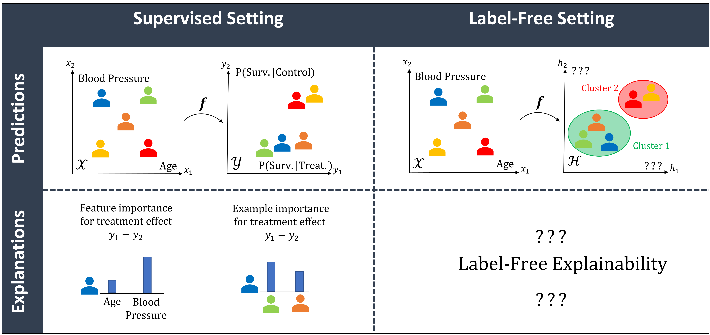
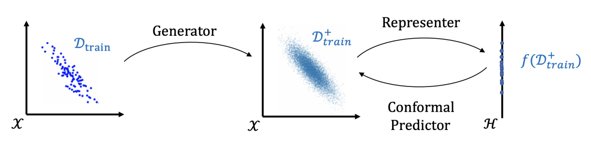

I'm extremely excited to present 2 works at [ICML 2022](https://icml.cc/Conferences/2022)  :tada:
They touch on various subjects ranging from explainable AI to robust and data-centric machine learning.
Unfortunately, I will be unable to attend the conference in person. Hence, do not miss the opportunity to interact with me during the online sessions. I'm always enthusiastic to engage and discuss these fascinating subjects :smile:
I will post the relevant practical information [on this page]() once they are available. Stay tuned :radio:

[Label-Free Explainability]() is a new framework to extend feature and example importance methods to the unsupervised setting. If you have always dreamed to use SHAP or Influence Functions to explain the representations of your brand-new encoder, this paper is for you!

[Data-SUITE]() is a data-centric method to flag incongruous examples at inference time. If you want to avoid using your machine learning model on data that differs too much from the training data, you might want to take a look!
